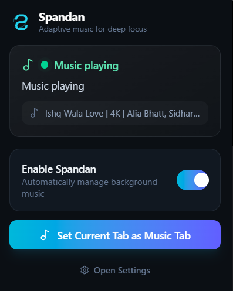
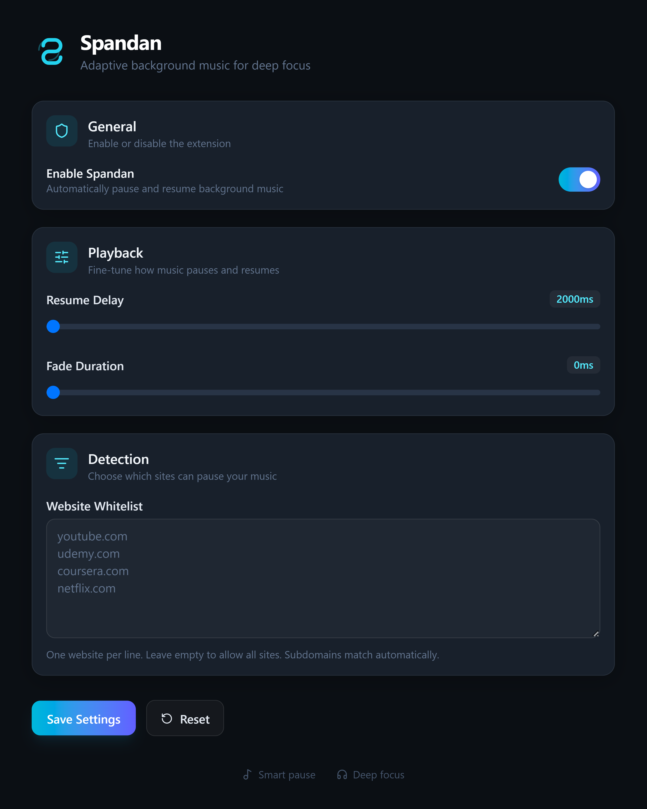
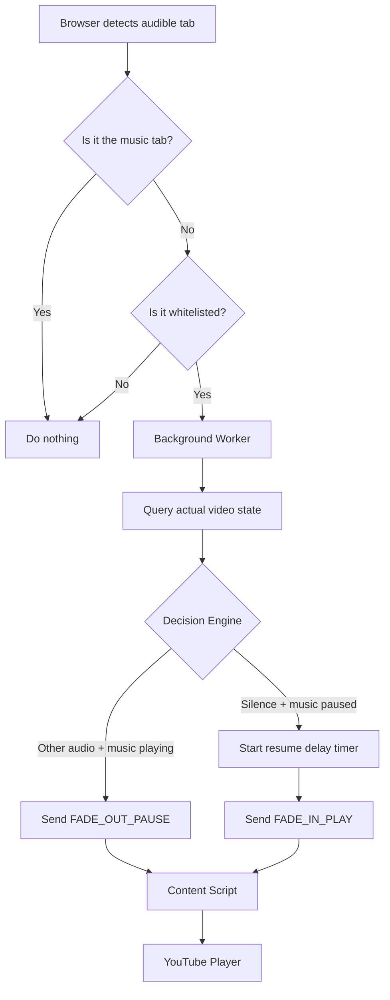

<div align="center">


# Spandan

**Adaptive Background Music for Deep Focus**

[](https://react.dev)
[](https://www.typescriptlang.org)
[](https://tailwindcss.com)
[](https://vitejs.dev)
[](LICENSE)

</div>

Spandan is a calm, minimal browser extension that intelligently pauses and resumes your background music while you study or work. It listens for audio from other tabs, gently fades out your music, and brings it back when the room is quiet again.

---

<!-- ## Screenshots

<div align="center">

  <p><em>Spandan keeps your focus flow uninterrupted.</em></p>

  <div style="display: flex; flex-wrap: wrap; justify-content: center; gap: 24px; margin-top: 16px;">
    <figure style="margin: 0;">
      
      <figcaption style="margin-top: 10px; font-size: 13px; color: #94a3b8;">Popup — at-a-glance status & quick controls</figcaption>
    </figure>
    <figure style="margin: 0;">
      
      <figcaption style="margin-top: 10px; font-size: 13px; color: #94a3b8;">Settings — fine-tune playback, fades & whitelist</figcaption>
    </figure>
  </div>

</div> -->

## Screenshots

<div align="center">

<p><em>Spandan keeps your focus flow uninterrupted.</em></p>


</div>


---

## Features

| Feature | Description |
|---|---|
| **Smart Auto Pause** | Detects when another tab starts playing audio and pauses your music. |
| **Smart Auto Resume** | Waits for silence, then gently fades your music back in. |
| **Fade In / Out** | Smooth volume transitions so pauses never feel jarring. |
| **Resume Delay** | Configure how long to wait before resuming. |
| **Manual Pause Detection** | If you manually pause or mute, Spandan respects your choice until you resume. |
| **Website Whitelist** | Only specific websites can pause your music. Leave empty to allow all. |
| **Persistent Settings** | Your preferences are saved across browser sessions. |
| **Lightweight Architecture** | Built with Manifest V3, React, TypeScript, and Tailwind CSS. |

---

## Installation

### Development

```bash
# Clone the repository
git clone https://github.com/yourusername/spandan.git
cd spandan

# Install dependencies
npm install

# Build the extension
npm run build
```

### Load in Brave / Chrome

1. Open `brave://extensions/` or `chrome://extensions/`.
2. Enable **Developer mode** in the top-right corner.
3. Click **Load unpacked**.
4. Select the `dist/` folder generated by the build.

The extension icon should appear in your toolbar.

---

## Folder Structure

```
spandan/
├── dist/                  # Built extension (load this folder unpacked)
├── options/               # Settings page entry
├── popup/                 # Popup entry
├── public/                # Static assets (manifest, icons, logo)
├── src/
│   ├── background/        # Service worker orchestration
│   ├── components/ui/     # Shared UI components
│   ├── content/           # Content script for YouTube video control
│   ├── lib/               # Storage, status, tabs, timers, video helpers
│   └── types/             # Shared TypeScript types
├── package.json
├── tsconfig.json
├── vite.config.ts
└── README.md
```

---

## Tech Stack

- **React 19** — UI library
- **TypeScript** — Type safety
- **Tailwind CSS 4** — Utility-first styling
- **Vite** — Build tooling
- **Chrome Extension Manifest V3** — Browser extension platform
- **Lucide React** — Consistent, elegant icons

---

## How It Works



Spandan treats the actual HTML5 `<video>` element as the single source of truth. It queries the real playback state before deciding to pause or resume, so stale storage never causes missed actions.

---

## Future Roadmap

- [ ] Support for multiple music providers beyond YouTube
- [ ] Spotify web player integration
- [ ] Custom fade curves (linear, ease-in, ease-out)
- [ ] Per-website pause/resume profiles
- [ ] Global keyboard shortcuts
- [ ] Dark / light theme toggle

---

## License

[MIT](LICENSE)

---

<div align="center">

Made with calm and focus.

</div>
